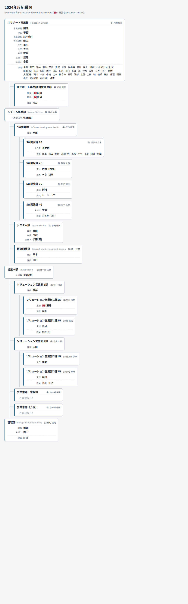

# Organization Chart Auto-Output App

Automatically generates a **printable organization chart** (HTML → PDF) from the two Syslabo
masters — `sys_user` (employees) and `cmn_department` (departments) — reproducing the information
in the hand-made `組織図(Current Organizational Chart).xlsx`.

Built for the Syslabo assignment. It covers Requirements **1 & 2** (the generator + reproducible
setup) and Requirement **4** (a concurrent-duties / 兼務 data model, wired in so the chart can
actually show the `(兼)` entries). See [`docs/concurrent-duties-design.md`](docs/concurrent-duties-design.md).



## Requirements

- **Node.js 20 or newer** (check with `node --version`). That's the only prerequisite —
  everything else is installed by `npm install`.

## Setup & usage

```bash
npm install          # install dependencies (SheetJS, TypeScript, tsx)
npm run chart        # read data/*.xlsx → write dist/organization-chart.html
```

Then open **`dist/organization-chart.html`** in any browser. To produce a PDF, use the browser's
**Print** dialog (Ctrl/Cmd + P) → *Save as PDF*. The print stylesheet targets **A3 landscape**;
adjust paper size/orientation in the dialog if you prefer.

`npm run chart` also prints a summary and flags any data problems, e.g.:

```
✓ Wrote dist/organization-chart.html
  20 departments · 4 roots · 95 people placed · 3 concurrent (兼務) entries
  No data warnings.
```

## How it works

```
data/*.xlsx ──▶ readMasters ──▶ buildOrg ──▶ renderHtml ──▶ dist/organization-chart.html
                (SheetJS)        (domain)      (HTML+CSS)
```

- **`src/readMasters.ts`** — parses the three xlsx files (SheetJS handles Japanese/UTF-8).
- **`src/buildOrg.ts`** — the domain core: builds the department tree, places each person into
  their department, orders each roster by position rank, disambiguates shared last names, and
  applies concurrent (兼務) postings.
- **`src/renderHtml.ts`** — renders the "tree + rosters" layout as one self-contained HTML file
  with inline print CSS.
- **`src/config.ts`** — **the file a maintainer edits** (see below).
- **`src/index.ts`** — CLI glue.

## Maintaining it (no code changes needed for the common cases)

Everything routine lives in **`src/config.ts`**:

| To change… | Edit in `src/config.ts` |
|---|---|
| Chart heading / year | `CHART_TITLE` |
| Position order / add a new title | `POSITION_RANK` |
| Japanese→English department labels | `DEPARTMENT_EN` |
| A special-case display name (e.g. a location tag) | `DISPLAY_OVERRIDES` |
| Input/output file locations | `PATHS` |

**Employee / department changes:** edit the xlsx files in `data/` (kept as copies of the
originals in `TryOutProgram/`) and re-run `npm run chart`.

**Concurrent duties (兼務):** edit `data/user_assignments.xlsx` (add/remove rows keyed by Sys ID)
and re-run. Regenerate the seed anytime with `npx tsx scripts/seed-assignments.ts`.

### Name display rule
People are shown by **last name only**. When two people share a last name, the given-name's first
character is appended in parentheses (`佐藤(悠)` / `佐藤(晃)`). Hand-crafted exceptions (e.g. the
`大西【大阪】` location tag) are pinned in `DISPLAY_OVERRIDES`.

## Tests

```bash
npm test             # node:test unit tests for the domain core (buildOrg)
```

## Data notes

- The provided masters are copied into `data/` and read as-is; the originals in `TryOutProgram/`
  are never modified.
- Two inconsistencies between the legacy chart and the master data (a missing `ソリューション営業部`
  department, and how 代表取締役 佐藤 is depicted) are documented in
  [`docs/concurrent-duties-design.md`](docs/concurrent-duties-design.md).
- Output is UTF-8 HTML, so Japanese prints correctly.

## Not included (this iteration)

Requirement 3 (a CRUD maintenance UI with change-history) is out of scope. The Requirement-4
model already includes `valid_from` / `valid_to` columns that a future history feature can build on.
# organization
